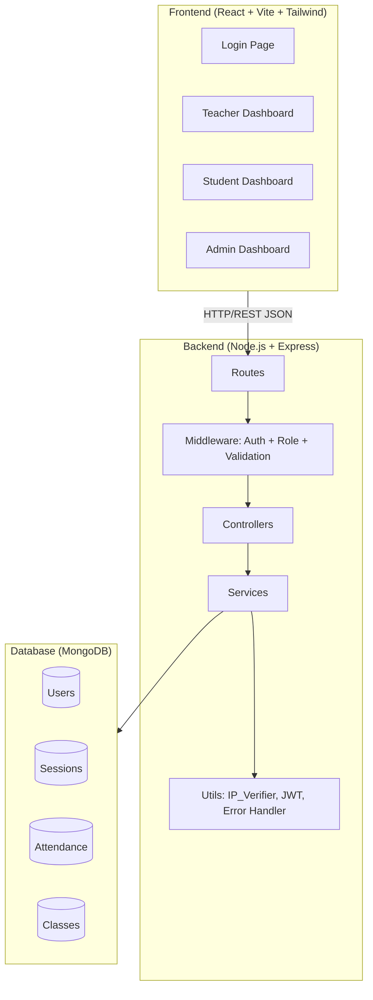

# Design Document: WiFi Attendance System

## Overview

The WiFi Attendance System is a web application that automates classroom attendance using IP-based network proximity verification. A teacher starts a session, students mark attendance from their devices, and the backend verifies they are on the same subnet as the teacher. Teachers review and finalize records; admins manage users and classes.

The stack is React (Vite) + Tailwind CSS on the frontend, Node.js + Express on the backend, and MongoDB as the database. The backend follows a clean layered architecture: Routes → Middleware → Controllers → Services → Models.

---

## Architecture



### Layer Responsibilities

- **Routes**: Map HTTP verbs + paths to controller functions
- **Middleware**: JWT verification, role-based access control, request body validation (Zod)
- **Controllers**: Parse request, call service, return HTTP response
- **Services**: Business logic — session management, attendance logic, IP verification, user management
- **Models**: Mongoose schemas with indexes and constraints
- **Utils**: Stateless helpers — IP subnet comparison, JWT sign/verify, centralized error classes

---

## Components and Interfaces

### Auth Flow

```
POST /api/auth/login
  → validateSchema(loginSchema)
  → AuthController.login
  → AuthService.login(email, password)
    → UserModel.findByEmail(email)
    → bcrypt.compare(password, hash)
    → jwt.sign({ userId, role })
  ← { token, user: { id, name, role } }
```

### Session Flow

```
POST /api/session/start
  → authenticate → requireRole("teacher")
  → SessionController.start
  → SessionService.startSession(teacherId, classId, subject, teacherIP)
    → check no active session for classId
    → SessionModel.create(...)
  ← { session }

GET /api/session/active?classId=...
  → authenticate
  → SessionController.getActive
  → SessionService.getActiveSession(classId)
  ← { session | null }

POST /api/session/end
  → authenticate → requireRole("teacher")
  → SessionController.end
  → SessionService.endSession(sessionId, teacherId)
    → mark absent for all unmarked students
    → SessionModel.update(status: "closed", endTime)
  ← { session }
```

### Attendance Flow

```
POST /api/attendance/mark
  → authenticate → requireRole("student")
  → AttendanceController.mark
  → AttendanceService.markAttendance(studentId, sessionId, studentIP)
    → check session active
    → check no duplicate
    → IP_Verifier.sameSubnet(studentIP, teacherIP)
    → determine status (present|late) from time window
    → AttendanceModel.create(...)
  ← { record }

GET /api/attendance/session/:id
  → authenticate → requireRole("teacher")
  → AttendanceController.getBySession
  → AttendanceService.getSessionAttendance(sessionId)
  ← { verified: [...], unverified: [...], absent: [...] }

POST /api/attendance/manual
  → authenticate → requireRole("teacher")
  → AttendanceController.manual
  → AttendanceService.manualMark(teacherId, studentId, sessionId, status)
    → upsert record with source: "manual", verification: "teacher-approved"
  ← { record }

POST /api/attendance/submit
  → authenticate → requireRole("teacher")
  → AttendanceController.submit
  → AttendanceService.submitAttendance(sessionId, teacherId)
    → mark all unmarked students absent
    → close session
  ← { session }

PATCH /api/attendance/:id/approve
  → authenticate → requireRole("teacher")
  → AttendanceController.approve
  → AttendanceService.approveRecord(recordId, teacherId)
  ← { record }

PATCH /api/attendance/:id/reject
  → authenticate → requireRole("teacher")
  → AttendanceController.reject
  → AttendanceService.rejectRecord(recordId, teacherId)
  ← { record }
```

### Admin Flow

```
POST /api/admin/users
  → authenticate → requireRole("admin")
  → AdminController.createUser
  → AdminService.createUser(name, email, password, role)
  ← { user }

GET /api/admin/users
  → authenticate → requireRole("admin")
  → AdminController.listUsers
  ← { users }

POST /api/admin/classes
  → authenticate → requireRole("admin")
  → AdminController.createClass
  → AdminService.createClass(name, teacherId)
  ← { class }

POST /api/admin/classes/:id/assign
  → authenticate → requireRole("admin")
  → AdminController.assignStudent
  → AdminService.assignStudentToClass(classId, studentId)
  ← { user }

GET /api/admin/reports
  → authenticate → requireRole("admin")
  → AdminController.getReports
  → AdminService.getReports()
  ← { report }
```

---

## Data Models

### User

```javascript
{
  _id: ObjectId,
  name: String (required),
  email: String (required, unique, lowercase),
  password: String (required, hashed),
  role: String (enum: ["admin", "teacher", "student"], required),
  classId: ObjectId (ref: "Class", optional — for students),
  createdAt: Date,
  updatedAt: Date
}
// Index: email (unique)
```

### Class

```javascript
{
  _id: ObjectId,
  name: String (required),
  teacherId: ObjectId (ref: "User", required),
  createdAt: Date,
  updatedAt: Date
}
```

### Session

```javascript
{
  _id: ObjectId,
  classId: ObjectId (ref: "Class", required),
  teacherId: ObjectId (ref: "User", required),
  subject: String (required),
  startTime: Date (required),
  endTime: Date (optional),
  status: String (enum: ["active", "closed"], default: "active"),
  teacherIP: String (required),
  createdAt: Date,
  updatedAt: Date
}
// Index: { classId: 1, status: 1 } for fast active session lookup
```

### Attendance

```javascript
{
  _id: ObjectId,
  studentId: ObjectId (ref: "User", required),
  sessionId: ObjectId (ref: "Session", required),
  status: String (enum: ["present", "late", "absent"], required),
  verification: String (enum: ["verified", "unverified", "teacher-approved"], required),
  source: String (enum: ["wifi", "manual", "qr", "system"], required),
  time: Date (required),
  createdAt: Date,
  updatedAt: Date
}
// Index: { studentId: 1, sessionId: 1 } unique — prevents duplicates
```

---

## Correctness Properties

*A property is a characteristic or behavior that should hold true across all valid executions of a system — essentially, a formal statement about what the system should do. Properties serve as the bridge between human-readable specifications and machine-verifiable correctness guarantees.*

### Property 1: IP Subnet Match Symmetry

*For any* two valid IPv4 addresses A and B, `sameSubnet(A, B)` should return the same result as `sameSubnet(B, A)`.

**Validates: Requirements 12.2, 12.3**

---

### Property 2: IP Subnet Match Correctness

*For any* two IPv4 addresses that share the same first three octets, `sameSubnet` should return true; for any two that differ in any of the first three octets, it should return false.

**Validates: Requirements 12.2, 12.3**

---

### Property 3: Malformed IP Handling

*For any* string that is not a valid IPv4 address (e.g., missing octets, non-numeric segments, out-of-range values), `sameSubnet` should return false without throwing an exception.

**Validates: Requirements 12.4**

---

### Property 4: Duplicate Attendance Rejection

*For any* student and session, submitting a mark-attendance request a second time should always be rejected with a 409 status, regardless of the IP or timing of the second request.

**Validates: Requirements 5.7, 14.1, 14.2**

---

### Property 5: Time Window Status Assignment

*For any* session and mark-attendance request, if the request arrives within 5 minutes of `session.startTime`, the resulting status should be "present"; if it arrives after 5 minutes, the status should be "late".

**Validates: Requirements 5.4, 5.5**

---

### Property 6: Finalize Marks All Unmarked Students Absent

*For any* active session with N students in the class and M attendance records already submitted (M ≤ N), finalizing the session should result in exactly N total attendance records, with the remaining N - M records having status "absent" and source "system".

**Validates: Requirements 9.1**

---

### Property 7: Closed Session Rejects Further Marking

*For any* closed session, any subsequent mark-attendance request (wifi or manual) should be rejected with HTTP status 400.

**Validates: Requirements 9.4**

---

### Property 8: Password Never Exposed in Responses

*For any* API response from any endpoint, the response body should never contain a field named "password" at any nesting level.

**Validates: Requirements 2.5, 15.3**

---

### Property 9: Manual Mark Upsert Consistency

*For any* student and session, applying a manual attendance mark should result in exactly one Attendance_Record for that (studentId, sessionId) pair, regardless of whether a prior record existed.

**Validates: Requirements 8.1, 8.2**

---

### Property 10: Role-Based Access Enforcement

*For any* protected endpoint with a required role R, a request authenticated with a role other than R should always receive HTTP status 403.

**Validates: Requirements 1.5, 2.4, 3.4, 4.4, 6.3, 7.4, 8.4, 9.5, 10.3, 11.2**

---

### Property 11: Verification Status Derived from IP Comparison

*For any* mark-attendance request, the resulting verification field in the Attendance_Record should be "verified" if and only if `sameSubnet(studentIP, teacherIP)` returns true; otherwise it should be "unverified".

**Validates: Requirements 5.2, 5.3**

---

### Property 12: Session Creation Captures Correct Fields

*For any* valid session start request, the created session document should have status "active", a startTime equal to the time of creation, and a teacherIP equal to the IP extracted from the request.

**Validates: Requirements 4.1, 4.5**

---

### Property 13: Input Validation Rejects Invalid Payloads

*For any* API request body that is missing required fields or contains fields of the wrong type, the system should return HTTP status 400 with a response body that identifies the invalid fields.

**Validates: Requirements 13.1, 13.2**

---

### Property 14: Student History Isolation

*For any* student S requesting their attendance history, every record in the response should have a studentId equal to S's ID — no records belonging to other students should appear.

**Validates: Requirements 10.3**

---

### Property 15: Attendance Dashboard Grouping Correctness

*For any* session with a set of attendance records, the dashboard response should partition all records into exactly the groups "verified", "unverified", and "absent" with no record appearing in more than one group and no record omitted.

**Validates: Requirements 6.1, 6.2**

---

## Error Handling

All errors are handled by a centralized Express error-handling middleware. Services throw typed error classes; controllers do not contain try/catch logic.

```javascript
// Error class hierarchy
AppError (base)
  ├── ValidationError   (400)
  ├── UnauthorizedError (401)
  ├── ForbiddenError    (403)
  ├── NotFoundError     (404)
  ├── ConflictError     (409)
  └── InternalError     (500)
```

Error response shape:
```json
{
  "success": false,
  "error": {
    "code": "CONFLICT",
    "message": "Attendance already marked for this session"
  }
}
```

Success response shape:
```json
{
  "success": true,
  "data": { ... }
}
```

---

## Testing Strategy

### Dual Testing Approach

Both unit tests and property-based tests are required and complementary:

- **Unit tests** verify specific examples, edge cases, and integration points
- **Property tests** verify universal correctness across many generated inputs

### Property-Based Testing

**Library**: [fast-check](https://github.com/dubzzz/fast-check) (JavaScript/TypeScript PBT library)

Each property test must run a minimum of **100 iterations**.

Each test must be tagged with a comment in this format:
```
// Feature: wifi-attendance-system, Property N: <property_text>
```

| Property | Test Description | fast-check Arbitraries |
|---|---|---|
| P1 | Subnet match symmetry | `fc.ipV4()` pairs |
| P2 | Subnet match correctness | Generated IP pairs with controlled subnet overlap |
| P3 | Malformed IP handling | `fc.string()` with non-IP patterns |
| P4 | Duplicate attendance rejection | Random studentId + sessionId pairs |
| P5 | Time window status assignment | Random timestamps relative to session start |
| P6 | Finalize marks all absent | Random class sizes and partial attendance sets |
| P7 | Closed session rejects marking | Any mark request against a closed session |
| P8 | Password never in response | All API response objects |
| P9 | Manual mark upsert consistency | Random pre-existing record states |
| P10 | Role-based access enforcement | Random role assignments against protected routes |

### Unit Testing

**Library**: Jest (backend), Vitest (frontend)

Unit tests focus on:
- Specific examples for each API endpoint (happy path + error path)
- Edge cases: empty class, session with no students, malformed JWT
- Integration between service and model layers using in-memory MongoDB (mongodb-memory-server)

### Frontend Testing

- Component tests with React Testing Library + Vitest
- Test login form validation, dashboard rendering, and attendance status display
